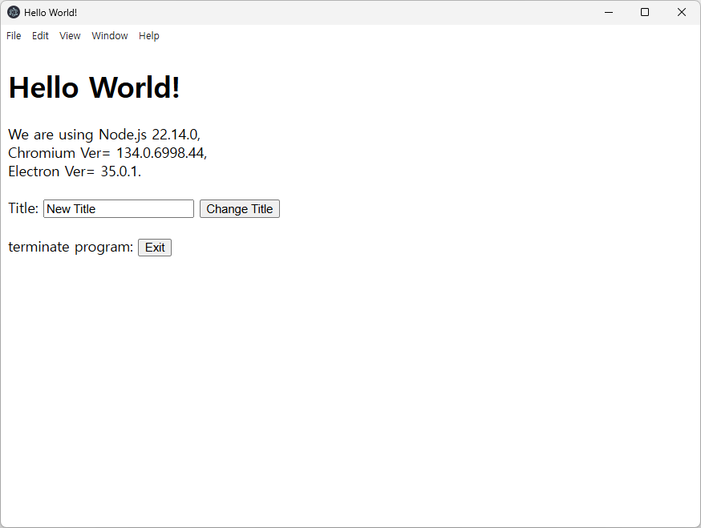

## electron Helow-worlld Example

1. mkdir electronHellowWorld & cd electronHellowWorld

2. npm init -y                     --> package.json만들어짐
3. npm i --save-dev electron       --> electron설치하고 dependancy저장

```   
{
   "name": "start-electron",
    "version": "1.0.0",
    "description": "",
    "main": "main.js",
    "scripts": {
      "start": "electron ."
    },
    "author": "",
    "license": "ISC",
    "devDependencies": {
      "electron": "^35.0.1"
    }
  }
```

```
====================================
HTML,DOM,preload,renderer, main IPC
====================================
--- preload.js ---
contextBridge.exposeInMainWorld('utoAPI', {
  exitProgram: () => ipcRenderer.invoke('exit-program'),
  setTitle: (title) => ipcRenderer.send('set-title', title)
})

--- renderer.js ---
document.getElementById('btnExit').addEventListener('click',async () => {
  await window.utoAPI.exitProgram()
})

--- main.js ---
ipcMain.handle("exit-program", () => {
        BrowserWindow.getFocusedWindow().destroy();
        app.quit()
      });

```

5. index.html 파일 작성
6. preload.js 파일 작성
7. renderer.js 파일 작성
8. main.js  파일 작성
9. npm run start 프로그램 실행



   
